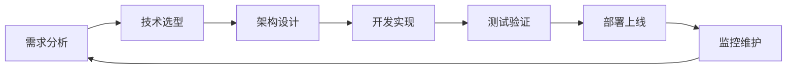

<div align="center">

# 👋 你好，我是 coders-user


**💻 全栈开发工程师** | **🎯 专注于构建高性能Web应用**

</div>

---

## 💼 **技术专长领域**

```javascript
const 全栈开发者 = {
    身份: "全栈Web开发工程师",
    专业方向: "现代化Web应用架构设计与开发",
    
    核心技能: {
        前端架构: ["响应式设计", "组件化开发", "性能优化", "用户体验"],
        后端架构: ["API设计", "数据库设计", "系统架构", "性能调优"],
        项目管理: ["技术选型", "架构决策", "代码审查", "团队协作"],
        解决方案: ["业务分析", "技术实现", "问题诊断", "优化升级"]
    },
    
    工作重心: "构建可维护、可扩展、高性能的Web应用系统",
    技术理念: "追求代码的优雅与系统的稳定性"
};
```

## 🛠️ **技术栈体系**

<table>
<tr>
<td width="50%" valign="top">

### 🎨 **前端技术栈**

**核心语言**
-  **HTML5** - 语义化标记与可访问性
-  **CSS3** - 现代样式设计与动画
-  **JavaScript** - ES6+特性与异步编程
-  **TypeScript** - 类型安全的JavaScript开发

**前端框架**
-  **Vue.js** - 渐进式前端框架
-  **React** - 组件化UI开发

**样式工具**
-  **Tailwind CSS** - 实用优先的CSS框架
-  **Bootstrap** - 响应式组件库
-  **Sass** - CSS预处理器

</td>
<td width="50%" valign="top">

### ⚙️ **后端技术栈**

**运行时环境**
-  **Node.js** - JavaScript服务端运行时
-  **Python** - 多用途编程语言
-  **Java** - 企业级应用开发

**框架技术**
-  **Express.js** - 快速Web应用框架
-  **FastAPI** - 现代Python Web框架
-  **Spring Boot** - Java应用开发框架

**数据存储**
-  **MySQL** - 关系型数据库
-  **PostgreSQL** - 高级开源数据库
-  **MongoDB** - 文档型数据库
-  **Redis** - 内存数据结构存储

</td>
</tr>
</table>

### 🚀 **开发工具与部署**

<div align="center">


</div>

---

## 🏗️ **架构与开发理念**

<table>
<tr>
<td align="center" width="25%">

<br><strong>用户体验优先</strong>
<br><sub>以用户需求为核心的设计思维</sub>
</td>
<td align="center" width="25%">

<br><strong>性能优化</strong>
<br><sub>追求极致的加载速度与响应</sub>
</td>
<td align="center" width="25%">

<br><strong>代码质量</strong>
<br><sub>可维护、可扩展的代码架构</sub>
</td>
<td align="center" width="25%">

<br><strong>技术创新</strong>
<br><sub>拥抱新技术，持续技术升级</sub>
</td>
</tr>
</table>

## 💡 **核心技术能力**

<div align="center">

| **前端开发** | **后端开发** | **数据库设计** | **系统架构** |
|:---:|:---:|:---:|:---:|
| SPA应用开发 | RESTful API设计 | 数据库架构设计 | 微服务架构 |
| 响应式布局 | 服务端渲染 | 查询性能优化 | 负载均衡 |
| 组件化开发 | 身份认证授权 | 数据迁移 | 容器化部署 |
| 前端工程化 | 消息队列处理 | 备份策略 | 监控告警 |

</div>

---

## 📊 **GitHub 代码统计**

<div align="center">

<table>
<tr>
<td width="50%">


</td>
<td width="50%">


</td>
</tr>
</table>


</div>

---

## 🎯 **专业专长**

<details>
<summary><b>🌐 Web应用开发</b></summary>
<br>

- **单页应用(SPA)开发** - 使用Vue.js/React构建复杂交互应用
- **服务端渲染(SSR)** - 提升SEO表现和首屏加载速度
- **渐进式Web应用(PWA)** - 提供类原生应用体验
- **响应式设计** - 适配各种设备和屏幕尺寸

</details>

<details>
<summary><b>🔧 API与后端服务</b></summary>
<br>

- **RESTful API设计** - 遵循REST架构原则的API开发
- **GraphQL** - 灵活的数据查询语言实现
- **微服务架构** - 服务拆分与容器化部署
- **数据库优化** - 查询优化和索引设计

</details>

<details>
<summary><b>⚡ 性能优化</b></summary>
<br>

- **前端性能优化** - 代码分割、懒加载、缓存策略
- **后端性能调优** - 数据库优化、缓存设计、并发处理
- **网络优化** - CDN配置、Gzip压缩、HTTP/2
- **监控与分析** - 性能指标监控和瓶颈分析

</details>

<details>
<summary><b>🔒 安全与质量</b></summary>
<br>

- **Web安全** - XSS防护、CSRF防护、SQL注入防护
- **身份认证** - JWT、OAuth2.0、RBAC权限控制
- **代码质量** - ESLint、代码审查、单元测试
- **CI/CD** - 自动化构建、测试和部署流程

</details>

---

## 💻 **开发工作流**



---

## 🌟 **专业理念**

<div align="center">

> **"优秀的代码不仅要解决问题，更要经得起时间的考验"**

🎯 **专注于** • 用户体验 • 代码质量 • 性能优化 • 技术创新

</div>

---

<div align="center">

## 📈 **持续进步中**


**⭐ 每一行代码都是向更好的Web世界迈进的一步**

</div>

<div align="center">

</div>