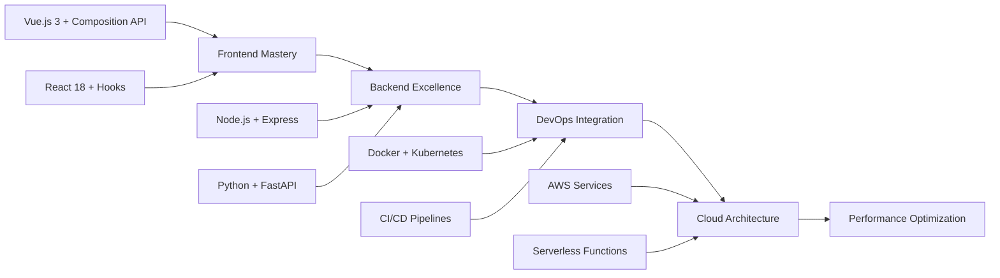

<div align="center">

# 👨‍💻 Full Stack Web Developer


</div>

---

## 🎯 **Professional Overview**

```javascript
const developer = {
  role: "Full Stack Web Developer",
  experience: "Web Development Specialist",
  architecture: ["SPA", "RESTful APIs", "Microservices", "Serverless"],
  
  currentFocus: {
    frontend: "Building responsive and interactive user experiences",
    backend: "Creating robust and scalable server-side applications",
    devops: "Implementing efficient CI/CD pipelines",
    learning: "Exploring cloud-native technologies"
  },
  
  workingOn: [
    "Modern web application architectures",
    "Performance optimization techniques", 
    "Cloud deployment strategies",
    "API design best practices"
  ]
};
```

---

## 💻 **Technology Stack**

<details>
<summary><b>🎨 Frontend Technologies</b></summary>
<br>

**Core Languages & Markup**
-  HTML5 - Semantic markup and accessibility
-  CSS3 - Modern styling and animations
-  JavaScript - ES6+ features and async programming

**Frameworks & Libraries**
-  Vue.js - Progressive framework for user interfaces
-  React - Component-based UI development
-  TypeScript - Type-safe JavaScript development

**Styling & UI**
-  Tailwind CSS - Utility-first CSS framework
-  Bootstrap - Responsive component library
-  Sass - Enhanced CSS with variables and mixins

</details>

<details>
<summary><b>⚙️ Backend Technologies</b></summary>
<br>

**Runtime & Frameworks**
-  Node.js - JavaScript runtime for server-side development
-  Express.js - Fast web application framework
-  Python - Versatile programming language
-  Java - Enterprise-grade application development

**API & Web Services**
-  FastAPI - Modern Python web framework
-  Spring Boot - Java application framework
-  GraphQL - Query language for APIs

</details>

<details>
<summary><b>🗄️ Database Technologies</b></summary>
<br>

**Relational Databases**
-  MySQL - Reliable relational database
-  PostgreSQL - Advanced open-source database
-  SQLite - Lightweight embedded database

**NoSQL & Caching**
-  MongoDB - Document-oriented database
-  Redis - In-memory data structure store

</details>

<details>
<summary><b>☁️ DevOps & Tools</b></summary>
<br>

**Version Control & Collaboration**
-  Git - Distributed version control
-  GitHub - Code hosting and collaboration

**Cloud & Deployment**
-  AWS - Cloud computing services
-  Docker - Containerization platform
-  Nginx - Web server and reverse proxy

**Development Environment**
-  VS Code - Primary code editor
-  Postman - API development and testing

</details>

---

## 🛠️ **Development Practices**

<table>
<tr>
<td width="50%">

### 🏗️ **Architecture Patterns**
- **MVC/MVP/MVVM** - Separation of concerns
- **Microservices** - Scalable system design  
- **RESTful APIs** - Standard web services
- **JAMstack** - Modern web architecture
- **Serverless** - Event-driven computing

</td>
<td width="50%">

### 📐 **Code Quality Standards**
- **Clean Code** - Readable and maintainable
- **SOLID Principles** - Object-oriented design
- **DRY/KISS** - Efficient coding practices
- **Code Reviews** - Collaborative development
- **Unit Testing** - Reliable code verification

</td>
</tr>
</table>

---

## 📊 **Development Metrics**

<div align="center">

<table>
<tr>
<td width="50%">


</td>
<td width="50%">


</td>
</tr>
</table>


</div>

---

## 🎯 **Current Learning Path**



---

## 🔧 **Development Workflow**

<details>
<summary><b>💼 Project Development Process</b></summary>

1. **📋 Planning & Analysis**
   - Requirements gathering and analysis
   - Technical architecture design
   - Technology stack selection

2. **🎨 Design & Prototyping**
   - UI/UX wireframing
   - Database schema design
   - API endpoint planning

3. **⚡ Development & Implementation**
   - Frontend component development
   - Backend API implementation
   - Database integration

4. **🧪 Testing & Quality Assurance**
   - Unit and integration testing
   - Code review and optimization
   - Performance testing

5. **🚀 Deployment & Monitoring**
   - CI/CD pipeline setup
   - Production deployment
   - Performance monitoring

</details>

---

## 📈 **Areas of Expertise**

<div align="center">

| **Web Development** | **Database Design** | **API Development** | **Cloud Services** |
|:---:|:---:|:---:|:---:|
| SPA Applications | Schema Optimization | RESTful Services | AWS Deployment |
| Responsive Design | Query Performance | GraphQL APIs | Container Orchestration |
| Progressive Enhancement | Data Modeling | Authentication | Serverless Architecture |

</div>

---

## 🌟 **Professional Philosophy**

> *"Building robust, scalable, and maintainable web applications through clean code, best practices, and continuous learning."*

<div align="center">

**🎯 Focus Areas**: Code Quality • Performance • Scalability • User Experience

</div>

---

<div align="center">


**⭐ Building the future of web, one commit at a time**

</div>